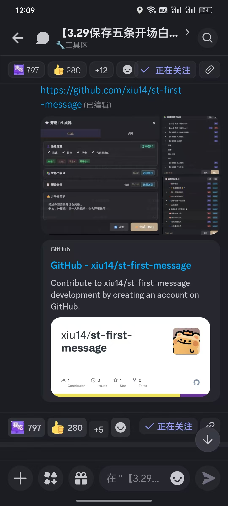

# First Message Generator & Status Bar Assistant

A [SillyTavern](https://github.com/SillyTavern/SillyTavern) extension that uses AI to generate tailored opening messages for character cards, with one-click dynamic UI status bar generation.

## Community & Adoption



| Metric | Value |
|--------|-------|
| Discord Upvotes | **797** |
| GitHub Unique Cloners | **233** |
| GitHub Total Views | **114** |

## Features

### Opening Message Generation
- **Smart character reading**: Automatically extracts character descriptions, personality, scenarios, and existing opening messages.
- **World Book & preset integration**: Selectively include World Book entries and global preset entries as AI context for more accurate generation.
- **Custom creative direction**: Add specific narrative requirements (e.g. "suspenseful tone", "rich environmental descriptions") to guide AI output.

### Dynamic Status Bar Generation
- **AI-powered UI rendering**: Reads character settings and world-building lore, then auto-generates themed HTML/CSS status bars (e.g. parchment panels with time/weather/mood/HP displays).
- **One-click deployment**: No manual configuration needed — the plugin automatically parses generated status bars into World Book content templates and UI replacement regex scripts, injecting them directly into the character card's extension data.
- **Data isolation & safety**:
  - Quick reset: One-click clear for input fields and previews.
  - Character-switch protection: Automatically detects character changes and clears previous drafts to prevent cross-contamination.

### API Configuration
- Compatible with OpenAI and Gemini API formats.
- Supports custom API URLs (including proxy endpoints).
- Auto-fetch available models from your API provider.
- Credentials stored securely in browser local storage.

## Installation

Install via SillyTavern's built-in extension installer using this repository URL:
```
https://github.com/xiu14/st-first-message
```

## Quick Start

### Generate Opening Messages
1. Open the "First Message Generator" from SillyTavern's wand menu.
2. Confirm the target character is displayed at the top.
3. (Optional) Select relevant World Book / preset entries for context.
4. Describe your desired tone, click "✨ Generate", and get your custom opening message.

### Generate & Deploy Status Bars
1. Switch to the "Status Bar" tab.
2. Describe your design idea (e.g. "sci-fi tactical terminal with energy, armor, location, and target indicators").
3. Click "✨ Generate Status Bar" — AI generates a live preview, World Book XML template, and matching regex script.
4. Click "Apply World Book Entry" and "Apply Regex Script" to deploy.
5. Refresh SillyTavern to see your custom UI in action.

---

<details>
<summary>📖 中文说明 (Chinese Documentation)</summary>

## 开场白生成器 (及状态栏助手)

SillyTavern 扩展插件 - 使用 AI 为角色卡生成精准的开场白，并提供一键式动态 UI 状态栏生成能力。

### 核心功能

#### 📝 开场白定制
- **角色信息智能读取**: 自动抓取角色描述、性格、场景及当前既有开场白。
- **世界书与预设融合**: 支持灵活勾选关联的【世界书条目】及常用【全局预设条目】作为 AI 创作时的参考上下文。
- **自定义脑洞需求**: 可任意输入细节或叙事要求（如"充满悬疑感"、"大量环境描写铺垫"等），让 AI 遵循特定基调。

#### 🎨 智能状态栏生成 (全新)
- **动态 UI 效果渲染**: 充分阅读当前角色的设定与世界观，由 AI 为你自动编写并渲染精美的 HTML/CSS 主题状态栏（例如：定制属于角色的羊皮纸面板、包含时间/天气/心情/血量等状态）。
- **一键无缝自动化应用**: 无需繁琐配置，插件会自动将生成的状态栏解析出底层的【世界书内容模板】和【UI界面替换正则脚本】，点击应用按钮后将直接静默注入到该角色卡的拓展数据中，即刻生效。
- **双管齐下的数据隔离保护**:
  - **随时重置**：配备【🗑️ 快速清除】操作，一键清空输入框和长篇预览。
  - **切卡防串台**：底层监听角色数据切换。当你在主线更换了角色卡并重新唤出该插件时，系统将自动识别并立即清空上一位角色的任何残留预览和草稿生成痕迹，100% 杜绝了张冠李戴的误操作风险。

### 使用指南

#### 生成开场白
1. 点击 SillyTavern 界面顶部魔杖菜单中的「开场白生成器」即可打开独立悬浮窗。
2. 停留在「生成」页，并确认顶部显示出了你当前希望操作的角色名。
3. （可选）点击对应栏目的「选择条目」按钮，摘取相关的设定百科。
4. 描述期待的文学基调，点击「✨ 生成开场白」，稍等片刻即可获得专属台本。

#### 生成与部署状态栏
1. 切换至「状态栏」标签页。
2. 在输入框描述你天马行空的设计想法（例如："科幻战术终端面板，包含当前机体能量、装甲值、位置和目标指示"）。
3. 点击「✨ 生成状态栏」。AI 会自动编写排版并在下方折叠区生成：**实时显示效果预览**、**世界书XML代码模板** 以及 **实现此设计的匹配正则**。
4. 觉得效果满意吗？直接依次点击底部的「📋 应用世界书条目」和「🎨 应用正则脚本」。
5. **部署完毕**！无需别的操作，刷新下 SillyTavern 网页，返回对话就能看到华丽的专属定制界面了！

### API 无缝配置

切换至「API」标签页，填入你的专属模型参数开始使用：
- **API 类型**: 完美兼容传统 OpenAI 接口规范以及最新的 Gemini 接口。
- **API URL**: 直接填写基础链路（支持各类中转代理）。
- **获取模型**: 填入 Key 后，点击「获取」可立即自动列出服务器支持的所有主流/冷门模型。
- **本地存储**: 配置安全静默保存在您的浏览器持久化缓存中，即开即用。

</details>

## License

MIT

